## 一、实验名称

#### 逆向工程

## 二、逆向程序

```c
#include<windows.h>
int global_variable = 3;
int addfunction(int a, int b)
{
	return a + b;
}
int subfunction(int a, int b)
{
	return a - b;
}
int main()
{
	int num[6] = { -5,-10,1,7,6,3 };
	int i = 0, j = 0;
	int add[6] = { 0 };
	int sub[6] = { 0 };
	int samecount = 0;
	int lower_zerocount = 0, higher_zerocount = 0;
	for (i = 0; i < 6; i++)
	{
		add[i] = addfunction(num[i] , global_variable);
		sub[i] = subfunction(num[i] , global_variable);
	}

	for (i = 0; i < 6; i++)
	{
		if (sub[i] < 0)
		{
			lower_zerocount++;
		}
		else {
			higher_zerocount++;
		}
	}
	switch (lower_zerocount)
	{
	case 0:
		MessageBoxA(NULL, "数组中小于3的个数为：0", "Result", MB_OK);
                break;
	case 1:
		MessageBoxA(NULL, "数组中小于3的个数为：1", "Result", MB_OK);
                break;
	case 2:
		MessageBoxA(NULL, "数组中小于3的个数为：2", "Result", MB_OK);
                break;
	case 3:
		MessageBoxA(NULL, "数组中小于3的个数为：3", "Result", MB_OK);
                break;
	default:
		break;
	}
	return 0;
}
```

## 三、实验过程

#### 1. 对代码进行反汇编，获得函数导入表

```
#获得反汇编代码
dumpbin /disasm re.exe
#获得导入表
dumpbin /imports re.exe
```

```bash
#导入表
Dump of file re.exe

File Type: EXECUTABLE IMAGE

  Section contains the following imports:

    USER32.dll
                4005B8 Import Address Table
                400798 Import Name Table
                     0 time date stamp
                     0 Index of first forwarder reference

                  246 MessageBoxA

    KERNEL32.dll
                4005A0 Import Address Table
                400780 Import Name Table
                     0 time date stamp
                     0 Index of first forwarder reference

                  36D IsProcessorFeaturePresent
                  582 UnhandledExceptionFilter
                  543 SetUnhandledExceptionFilter
                  209 GetCurrentProcess
                  561 TerminateProcess

  Summary

         3C0 .data
          20 .gfids
         2C0 .rdata
          80 .reloc
         320 .text
```

#### 2.获得函数体以及函数间调用关系

- 依据call指令获得被调用函数体在内存中的起始地址

  |                          | 内部函数     | 外部函数API                 |
  | ------------------------ | ------------ | :-------------------------- |
  | 调用方式                 | call 地址    | call 指针                   |
  | 内存中存储位置确定时间   | 静态链接编译 | 动态链接加载外部dll         |
  | 导入表中是否具有函数名称 | 不具有       | 有，有所属dll和对应函数编号 |

 ##### (1).内部函数

在主函数中反汇编代码调用内部函数指令为 call  地址，call后地址即为内部函数在内存中的起始地址

```
内部函数( 1 )起始地址： 00400280
内部函数( 2 )起始地址： 00400290
内部函数( 3 )起始地址： 004002A0
内部函数( 4 )起始地址： 00400448
内部函数( 5 )起始地址： 00400459
内部函数( 6 )起始地址： 00400481
内部函数( 7 )起始地址： 0040057C
```

##### (2).外部函数

```bash
外部函数( 1 )起始地址： dword ptr ds:[004005A4h]
外部函数( 2 )起始地址： dword ptr ds:[004005A8h]
外部函数( 3 )起始地址： dword ptr ds:[004005ACh]
外部函数( 4 )起始地址： dword ptr ds:[004005B0h]
外部函数( 5 )起始地址： dword ptr ds:[004005B8h]
```

- 导入表中包含被调用的外部函数（编号，API名称，所属dll）

- （以MessageBoxA为例）在主函数中反汇编代码调用外部API指令为 `call dword ptr ds:[004005B8]`，在内存中寻找`0x4005B8`,或者当文件以16进制显示以后，在其中寻址0x4005B8（section alignment和file alignment相同，[在after.exe中都是20],通过文件也可以获得外部函数的名称） 

- 外部API在进行动态链接时通过计算确定得到在内存中的位置，并将表示位置（相对位置）的数值存入导入表固定的地址中，call指令后的指针指向这个固定的位置，在这个固定的位置中存储函数名称、对应编号、所属ddl等。

  - 内存中

  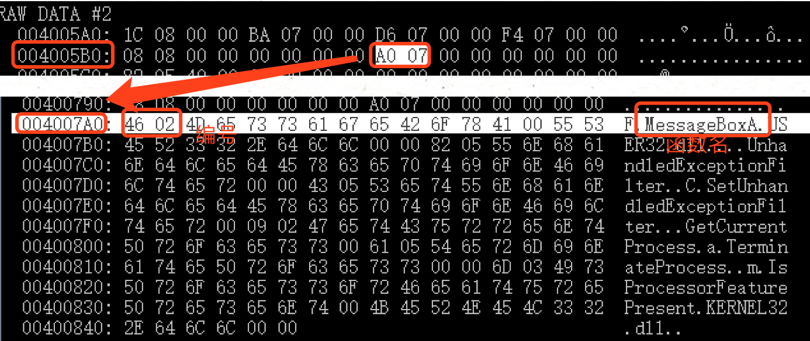

  - 文件中

  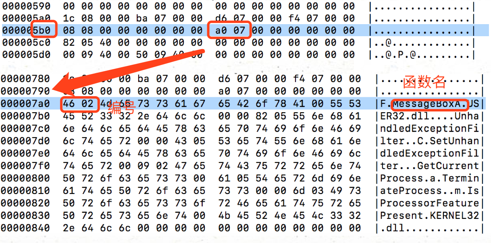

##### (3).函数间的调用关系

- 函数调用关系

  ```
  " 004002A0 "->" 00400280 "
  " 004002A0 "->" 00400290 "
  " 004002A0 "->" dword ptr ds:[004005B8h] "
  " 004002A0 "->" dword ptr ds:[004005B8h] "
  " 004002A0 "->" dword ptr ds:[004005B8h] "
  " 004002A0 "->" dword ptr ds:[004005B8h] "
  " 004002A0 "->" 00400448 "
  " 00400459 "->" dword ptr ds:[004005A8h] "
  " 00400459 "->" dword ptr ds:[004005A4h] "
  " 00400459 "->" dword ptr ds:[004005ACh] "
  " 00400459 "->" dword ptr ds:[004005B0h] "
  " 00400481 "->" 0040057C "
  " 00400481 "->" 00400459 "
  ```

- 调用关系图

  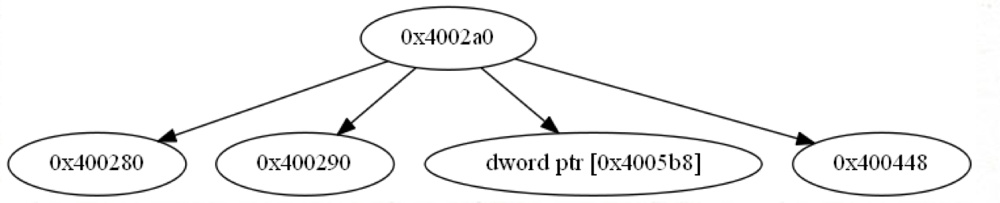

##### (5).实现python代码

```python
#############################################
######获取外部函数和内部函数以及函数间的调用关系######
#############################################

fun_list=[]
call_list=[]
becalled_list=[]
api_list=[]
file=open('/Users/cclin/PycharmProjects/reverseeng/disasm.txt')
count_call=0
for line in file:
     if(str(line).find('call')!=-1):
        count_call+=1
        call_ins=str(line).split('call')
        if(call_ins[1].find('ptr')!=-1):
           api_list.append(call_ins[1])
        fun_list.append(call_ins[1].strip('\n').strip(' ').strip('\t'))
        call_list.append(call_ins[0].split(':')[0])
        becalled_list.append(call_ins[1])

################################################
####################获取函数体####################
################################################
file=open('/Users/cclin/PycharmProjects/reverseeng/disasm.txt')
callfile=list()

for line in file:
    callfile.append(str(line))

len=len(callfile)
start_list=[0]*1000
end_list=[0]*100
startaddress_list=[0]*100
endaddress_list=[0]*100
count=0
call_count=-1
i=0

for line in callfile:
    if(str(callfile[count]).find('push')!=-1):
      pushobj=str(callfile[count]).split('push')
      if (pushobj[1].find('ebp')!=-1):
          if(pushobj[1].find('ptr')==-1):
            call_count+=1
            start_list[call_count]=count
            startaddress_list[call_count]=pushobj[0]
            i=count+1
            for i in range(count+1,len):
                if(str(callfile[i]).find('pop')!=-1):
                    popobj=str(callfile[i]).split("pop")
                    if(popobj[1].find('ebp')!=-1):
                        if(str(callfile[i+1]).find('ret')!=-1):
                            end_list[call_count]=i+1
                            thisline=str(callfile[i+1]).split('ret')
                            startaddress_list[call_count] = (pushobj[0].split(':'))[0].strip(' ')
                            endaddress_list[call_count]=thisline[0]
                            break
    count+=1

file=open('/Users/cclin/PycharmProjects/reverseeng/disasm.txt')
callfile=list()

for line in file:
    callfile.append(str(line))
for k in range(0,call_count+1):
    if startaddress_list[k] not in fun_list:
        fun_list.append(startaddress_list[k])
fun_list=list(set(fun_list))
fun_list.sort()
external_count=1
internal_count=1
print("\n=======================函数起始地址=========================\n")
for afun in fun_list:
    if(str(afun).find('ptr')!=-1):

       print("外部函数(",external_count,")起始地址：",afun)
       external_count+=1
    else:
        print("内部函数(",internal_count,")起始地址：",afun)
        internal_count+=1
print("\n=========================================================\n")

print("\n=====================函数调用关系========================\n")
for j in range(0,count_call):
    if str(call_list[j]).strip(' ') in fun_list:
        callincress=1
    else:
        callincress=0
    fun_list.insert(0,str(call_list[j]).strip(' '))
    fun_list.sort()
    callindex=fun_list.index(str(call_list[j]).strip(' '))+callincress
    print('\"',fun_list[callindex-1],'\"->\"',str(becalled_list[j]).strip(),'\"')
    fun_list.remove(str(call_list[j]).strip(' '))
print("\n=========================================================\n")


print("\n========================函数体============================\n")
call_bodies=list()
val_counts=[0]*100
global_vals=[0]*100
global_valhasappend=list()
for k in range(0,call_count+1):
    l=start_list[k]
    call_body=""
    ebp_counts = 0
    global_valcounts = 0
    local_valshasappend = list()
    global_valhasappend = list()
    for l in range (start_list[k],end_list[k]+1):
        if(str(callfile[l]).find('int')==-1):
           call_body=call_body+str(callfile[l])
        #获取函数体内的局部变量
        if str(callfile[l]).find('ptr')!=-1 and str(callfile[l]).find('ebp')!=-1 and str(callfile[l]).find('-')!=-1 :
            val = str(callfile[l]).split('-')[1].strip()
            val=val.split(']')[0]
            if str(local_valshasappend).find(val)==-1:
              local_valshasappend.append(str(val))
              ebp_counts+=1
        val_counts[k]=ebp_counts
        # 获取函数体内的全局变量
        if str(callfile[l]).find('ptr')!=-1 and str(callfile[l]).find('call')==-1 and str(callfile[l]).find('ebp')==-1 :
            global_val=str(callfile[l]).split('ptr')[1].strip('\n').strip()
            if global_val.find('eax')==-1 and global_val.find('ebx')==-1 and global_val.find('ecx')==-1 and global_val.find('edx')==-1:
                if str(global_valhasappend).find(global_val)==-1:
                     global_valhasappend.append(str(global_val))
                     global_valcounts +=1
            global_vals[k]=global_valcounts


    call_bodies.append(call_body)
    print("\n======================[",startaddress_list[k],"]=======================\n",call_bodies[k])
    print("\n=========================================================\n")
```

#### 3.函数参数、变量分析

##### (1).获得内部函数全局变量与局部变量

- 全局变量（16个）

  ```bah
  00400280 使用: 0 个
  00400290 使用: 0 个
  004002A0 使用: 2 个
  00400459 使用: 0 个
  00400481 使用: 16 个
  全局变量总个数： 18 个
  ```

- 局部变量

  ```bash
  00400280 : 0 个
  00400290 : 0 个
  004002A0 : 23 个
  00400459 : 0 个
  00400481 : 1 个
  ```

- Python代码

```python
print("\n======================函数局部变量与全局变量=======================\n")
call_bodies=list()
val_counts=[0]*100
global_vals=[0]*100
global_valhasappend=list()
for k in range(0,call_count+1):
    l=start_list[k]
    call_body=""
    ebp_counts = 0
    global_valcounts = 0
    local_valshasappend = list()
    global_valhasappend = list()
    for l in range (start_list[k],end_list[k]+1):
        if(str(callfile[l]).find('int')==-1):
           call_body=call_body+str(callfile[l])
        #获取函数体内的局部变量
        if str(callfile[l]).find('ptr')!=-1 and str(callfile[l]).find('ebp')!=-1 and str(callfile[l]).find('-')!=-1 :
            val = str(callfile[l]).split('-')[1].strip()
            val=val.split(']')[0]
            if str(local_valshasappend).find(val)==-1:
              local_valshasappend.append(str(val))
              ebp_counts+=1
        val_counts[k]=ebp_counts
        # 获取函数体内的全局变量
        if str(callfile[l]).find('ptr')!=-1 and str(callfile[l]).find('call')==-1 and str(callfile[l]).find('ebp')==-1 :
            global_val=str(callfile[l]).split('ptr')[1].strip('\n').strip()
            if global_val.find('eax')==-1 and global_val.find('ebx')==-1 and global_val.find('ecx')==-1 and global_val.find('edx')==-1:
                if str(global_valhasappend).find(global_val)==-1:
                     global_valhasappend.append(str(global_val))
                     global_valcounts +=1
            global_vals[k]=global_valcounts


    call_bodies.append(call_body)
    print("\n======================[",startaddress_list[k],"]=======================\n",call_bodies[k])
    print("\n=========================================================\n") print("\n======================函数的局部变量=======================\n")
for f in range(0,call_count+1):
    print(startaddress_list[f],":",val_counts[f],"个")
print("\n=========================================================\n")

print("\n======================函数的全局变量=======================\n")
all=0
for f in range(0,call_count+1):
    all=all+global_vals[f]
    print(startaddress_list[f],"使用:",global_vals[f],"个")
print("全局变量总个数：",all,"个")

print("\n=========================================================\n")
```

##### (2).获得函数参数个数

- 内部函数

  - 函数的参数通过在调用函数前执行push指令，将函数的参数压入栈，综合依据push指令等查找每个被调用内部函数中的参数个数

  - 函数调用后，栈内存储结构

    | 被调函数局部变量 |
    | ---------------- |
    | return返回地址   |
    | 上一个函数ebp    |
    | 函数参数         |

  - 内部函数

    ```bash
    0x4002a0 : 0个
    00400280 : 2 个
    00400290 : 2 个
    ```

- 外部API（以分析 MessageBoxA为例）

  ```bash
  dword ptr ds:[004005B8h] : 4 个
  dword ptr ds:[004005A8h] : 1 个
  dword ptr ds:[004005ACh] : 1 个
  dword ptr ds:[004005B0h] : 1 个
  ```

  - MessageBoxA，具有4个参数

    - 函数调用前执行参数压栈

      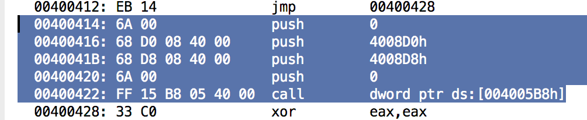

      - 使用`dumpbin /all `命令后从.data段中读取获取`MessageBoxA`第三个参数，分析 `push 0x40084D0->"Result"`，即在函数前第二个被压入栈内，得到MessageBoxA的三个参数为字符串“Result”。

        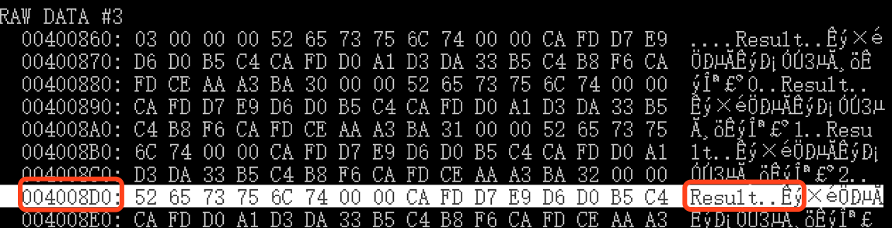

      - 其他外部API可依次分析得到

- Python 代码

  ```bash
  ################################################
  ####################获取函数的参数个数##############
  ################################################
  maincallfiledisasm=open('/Users/cclin/PycharmProjects/reverseeng/disasm.txt')
  
  callfile=[]
  
  for line in maincallfiledisasm:
      callfile.append(str(line))
  
  
  count=0;
  pushcount=0
  callcount=0
  calls=[0]*100
  local_vals=[0]*100
  calls_address=[0]*100
  havefind_calllist=""
  
  
  #寻找函数参数个数,函数的局部变量
  for line in range(0,len):
      if(str(callfile[count]).find('call')!=-1):
        call_line=str(callfile[count]).split('call')
        call=call_line[1]
        if(havefind_calllist.find(str(call))==-1):
          havefind_calllist=havefind_calllist+call
          i = 1
          pushcount = 0
          while i:
             if str(callfile[count-i]).find('call')!=-1:
                 break
             if i>count:
                 break
             if str(callfile[count-i]).find('push')!=-1:
                 pushobj = str(callfile[count - i]).split('push')
                 if (pushobj[1].find('ebp') != -1):
                       break
                 calls_address[callcount] = call
                 pushcount += 1
                 calls[callcount] = pushcount
             i += 1
          callcount+=1
      count += 1
  
  print("=======================函数参数个数========================")
  # for k in range(0,callcount-1):
  #   print(calls_address[k],"        ",calls[k],"个")
  print("0x4002a0 : 0个")
  for k in range(0,3):
    print(str(calls_address[k]).strip(),":",calls[k],"个")
  for k in range(4,5):
    print(str(calls_address[k]).strip(),":",calls[k],"个")
  for k in range(6,callcount-2):
    print(str(calls_address[k]).strip(),":",calls[k],"个")
  print("\n=========================================================\n")
  ```

#### 4.内部函数跳转等结构分析

##### (1).子函数：0x400280，0x400290

- 0x400280 实现两个数相加的功能，将指针dword ptr [ebp+8]和指针dword ptr[ebp+0ch]所指内存单元存储的内容相加。

  ```bash
    00400280: 55                 push        ebp
    00400281: 8B EC              mov         ebp,esp
    00400283: 8B 45 08           mov         eax,dword ptr [ebp+8]
    00400286: 03 45 0C           add         eax,dword ptr [ebp+0Ch]
    00400289: 5D                 pop         ebp
    0040028A: C3                 ret
  ```

- 0x400290 实现两个数相减的功能，将指针dword ptr [ebp+8]所指内存单元存储的内容减去指针dword ptr[ebp+0ch]所指内存单元存储的内容，结果存储在dword ptr [ebp+8]所指内存单元中。

  ```bash
    00400290: 55                 push        ebp
    00400291: 8B EC              mov         ebp,esp
    00400293: 8B 45 08           mov         eax,dword ptr [ebp+8]
    00400296: 2B 45 0C           sub         eax,dword ptr [ebp+0Ch]
    00400299: 5D                 pop         ebp
    0040029A: C3                 ret
  ```

##### (2).主函数：0x4002a0 主函数以main为入口，调用两个子函数0x400280，0x400290

- 基本块划分

  ```bash
  ===============[ 0x4002a0 ]-[ 0x400326 ]=================
  
  0x4002a0:	push 	ebp
  0x4002a1:	mov 	ebp, esp
  0x4002a3:	sub 	esp, 0x60
  0x4002a6:	mov 	eax, dword ptr [0x4008f8]
  0x4002ab:	xor 	eax, ebp
  0x4002ad:	mov 	dword ptr [ebp - 4], eax
  0x4002b0:	mov 	dword ptr [ebp - 0x1c], 0xfffffffb
  0x4002b7:	mov 	dword ptr [ebp - 0x18], 0xfffffff6
  0x4002be:	mov 	dword ptr [ebp - 0x14], 1
  0x4002c5:	mov 	dword ptr [ebp - 0x10], 7
  0x4002cc:	mov 	dword ptr [ebp - 0xc], 6
  0x4002d3:	mov 	dword ptr [ebp - 8], 3
  0x4002da:	mov 	dword ptr [ebp - 0x4c], 0
  0x4002e1:	xor 	eax, eax
  0x4002e3:	mov 	dword ptr [ebp - 0x48], eax
  0x4002e6:	mov 	dword ptr [ebp - 0x44], eax
  0x4002e9:	mov 	dword ptr [ebp - 0x40], eax
  0x4002ec:	mov 	dword ptr [ebp - 0x3c], eax
  0x4002ef:	mov 	dword ptr [ebp - 0x38], eax
  0x4002f2:	mov 	dword ptr [ebp - 0x34], 0
  0x4002f9:	xor 	ecx, ecx
  0x4002fb:	mov 	dword ptr [ebp - 0x30], ecx
  0x4002fe:	mov 	dword ptr [ebp - 0x2c], ecx
  0x400301:	mov 	dword ptr [ebp - 0x28], ecx
  0x400304:	mov 	dword ptr [ebp - 0x24], ecx
  0x400307:	mov 	dword ptr [ebp - 0x20], ecx
  0x40030a:	mov 	dword ptr [ebp - 0x50], 0
  0x400311:	mov 	dword ptr [ebp - 0x54], 0
  0x400318:	mov 	dword ptr [ebp - 0x58], 0
  0x40031f:	mov 	dword ptr [ebp - 0x5c], 0
  0x400326:	mov 	dword ptr [ebp - 0x50], 0
  
  包含jmp或jcc、cmp指令的函数起始地址: 0x4002a0
  
  ===============[ 0x40032f ]-[ 0x400335 ]=================
  
  0x40032f:	mov 	edx, dword ptr [ebp - 0x50]
  0x400332:	add 	edx, 1
  0x400335:	mov 	dword ptr [ebp - 0x50], edx
  
  包含jmp或jcc、cmp指令的函数起始地址: 0x40032d
  
  ===============[ 0x40033e ]-[ 0x40037f ]=================
  
  0x40033e:	mov 	eax, dword ptr [0x400860]
  0x400343:	push 	eax
  0x400344:	mov 	ecx, dword ptr [ebp - 0x50]
  0x400347:	mov 	edx, dword ptr [ebp + ecx*4 - 0x1c]
  0x40034b:	push 	edx
  0x40034c:	call 	0x400280
  0x400351:	add 	esp, 8
  0x400354:	mov 	ecx, dword ptr [ebp - 0x54]
  0x400357:	mov 	dword ptr [ebp + ecx*4 - 0x4c], eax
  0x40035b:	mov 	edx, dword ptr [0x400860]
  0x400361:	push 	edx
  0x400362:	mov 	eax, dword ptr [ebp - 0x50]
  0x400365:	mov 	ecx, dword ptr [ebp + eax*4 - 0x1c]
  0x400369:	push 	ecx
  0x40036a:	call 	0x400290
  0x40036f:	add 	esp, 8
  0x400372:	mov 	edx, dword ptr [ebp - 0x54]
  0x400375:	mov 	dword ptr [ebp + edx*4 - 0x34], eax
  0x400379:	mov 	eax, dword ptr [ebp - 0x54]
  0x40037c:	add 	eax, 1
  0x40037f:	mov 	dword ptr [ebp - 0x54], eax
  
  包含jmp或jcc、cmp指令的函数起始地址: 0x400338
  
  ===============[ 0x400384 ]-[ 0x400384 ]=================
  
  0x400384:	mov 	dword ptr [ebp - 0x50], 0
  
  包含jmp或jcc、cmp指令的函数起始地址: 0x400382
  
  ===============[ 0x40038d ]-[ 0x400393 ]=================
  
  0x40038d:	mov 	ecx, dword ptr [ebp - 0x50]
  0x400390:	add 	ecx, 1
  0x400393:	mov 	dword ptr [ebp - 0x50], ecx
  
  包含jmp或jcc、cmp指令的函数起始地址: 0x40038b
  
  ===============[ 0x40039c ]-[ 0x40039c ]=================
  
  0x40039c:	mov 	edx, dword ptr [ebp - 0x50]
  
  包含jmp或jcc、cmp指令的函数起始地址: 0x400396
  
  ===============[ 0x4003a6 ]-[ 0x4003ac ]=================
  
  0x4003a6:	mov 	eax, dword ptr [ebp - 0x58]
  0x4003a9:	add 	eax, 1
  0x4003ac:	mov 	dword ptr [ebp - 0x58], eax
  
  包含jmp或jcc、cmp指令的函数起始地址: 0x40039f
  
  ===============[ 0x4003b1 ]-[ 0x4003b7 ]=================
  
  0x4003b1:	mov 	ecx, dword ptr [ebp - 0x5c]
  0x4003b4:	add 	ecx, 1
  0x4003b7:	mov 	dword ptr [ebp - 0x5c], ecx
  
  包含jmp或jcc、cmp指令的函数起始地址: 0x4003af
  
  ===============[ 0x4003bc ]-[ 0x4003bf ]=================
  
  0x4003bc:	mov 	edx, dword ptr [ebp - 0x58]
  0x4003bf:	mov 	dword ptr [ebp - 0x60], edx
  
  包含jmp或jcc、cmp指令的函数起始地址: 0x4003ba
  
  ===============[ 0x4003c8 ]-[ 0x4003c8 ]=================
  
  0x4003c8:	mov 	eax, dword ptr [ebp - 0x60]
  
  包含jmp或jcc、cmp指令的函数起始地址: 0x4003c2
  
  ===============[ 0x4003d2 ]-[ 0x4003e0 ]=================
  
  0x4003d2:	push 	0
  0x4003d4:	push 	0x400864
  0x4003d9:	push 	0x40086c
  0x4003de:	push 	0
  0x4003e0:	call 	dword ptr [0x4005b8]
  
  包含jmp或jcc、cmp指令的函数起始地址: 0x4003cb
  
  ===============[ 0x4003e8 ]-[ 0x4003f6 ]=================
  
  0x4003e8:	push 	0
  0x4003ea:	push 	0x400888
  0x4003ef:	push 	0x400890
  0x4003f4:	push 	0
  0x4003f6:	call 	dword ptr [0x4005b8]
  
  包含jmp或jcc、cmp指令的函数起始地址: 0x4003e6
  
  ===============[ 0x4003fe ]-[ 0x40040c ]=================
  
  0x4003fe:	push 	0
  0x400400:	push 	0x4008ac
  0x400405:	push 	0x4008b4
  0x40040a:	push 	0
  0x40040c:	call 	dword ptr [0x4005b8]
  
  包含jmp或jcc、cmp指令的函数起始地址: 0x4003fc
  
  ===============[ 0x400414 ]-[ 0x400422 ]=================
  
  0x400414:	push 	0
  0x400416:	push 	0x4008d0
  0x40041b:	push 	0x4008d8
  0x400420:	push 	0
  0x400422:	call 	dword ptr [0x4005b8]
  
  包含jmp或jcc、cmp指令的函数起始地址: 0x400412
  
  ===============[ 0x400428 ]-[ 0x400437 ]=================
  
  0x400428:	xor 	eax, eax
  0x40042a:	mov 	ecx, dword ptr [ebp - 4]
  0x40042d:	xor 	ecx, ebp
  0x40042f:	call 	0x400448
  0x400434:	mov 	esp, ebp
  0x400436:	pop 	ebp
  0x400437:	ret
  ```

  - part one（for 循环）

    ```bash
    00400326: C7 45 B0 00 00 00  mov         dword ptr [ebp-50h],0
                00
      0040032D: EB 09              jmp         00400338
      0040032F: 8B 55 B0           mov         edx,dword ptr [ebp-50h]
      00400332: 83 C2 01           add         edx,1
      00400335: 89 55 B0           mov         dword ptr [ebp-50h],edx
      00400338: 83 7D B0 06        cmp         dword ptr [ebp-50h],6
      0040033C: 7D 46              jge         00400384
      0040033E: A1 60 08 40 00     mov         eax,dword ptr ds:[00400860h]
      00400343: 50                 push        eax
      00400344: 8B 4D B0           mov         ecx,dword ptr [ebp-50h]
      00400347: 8B 54 8D E4        mov         edx,dword ptr [ebp+ecx*4-1Ch]
      0040034B: 52                 push        edx
      0040034C: E8 2F FF FF FF     call        00400280
      00400351: 83 C4 08           add         esp,8
      00400354: 8B 4D AC           mov         ecx,dword ptr [ebp-54h]
      00400357: 89 44 8D B4        mov         dword ptr [ebp+ecx*4-4Ch],eax
      0040035B: 8B 15 60 08 40 00  mov         edx,dword ptr ds:[00400860h]
      00400361: 52                 push        edx
      00400362: 8B 45 B0           mov         eax,dword ptr [ebp-50h]
      00400365: 8B 4C 85 E4        mov         ecx,dword ptr [ebp+eax*4-1Ch]
      00400369: 51                 push        ecx
      0040036A: E8 21 FF FF FF     call        00400290
      0040036F: 83 C4 08           add         esp,8
      00400372: 8B 55 AC           mov         edx,dword ptr [ebp-54h]
      00400375: 89 44 95 CC        mov         dword ptr [ebp+edx*4-34h],eax
      00400379: 8B 45 AC           mov         eax,dword ptr [ebp-54h]
      0040037C: 83 C0 01           add         eax,1
      0040037F: 89 45 AC           mov         dword ptr [ebp-54h],eax
      00400382: EB AB              jmp         0040032F
    ```

  - part two （for循环嵌套if语句）

    ```bash
     00400384: C7 45 B0 00 00 00  mov         dword ptr [ebp-50h],0
                00
      0040038B: EB 09              jmp         00400396
      0040038D: 8B 4D B0           mov         ecx,dword ptr [ebp-50h]
      00400390: 83 C1 01           add         ecx,1
      00400393: 89 4D B0           mov         dword ptr [ebp-50h],ecx
      00400396: 83 7D B0 06        cmp         dword ptr [ebp-50h],6
      0040039A: 7D 20              jge         004003BC
      0040039C: 8B 55 B0           mov         edx,dword ptr [ebp-50h]
      0040039F: 83 7C 95 CC 00     cmp         dword ptr [ebp+edx*4-34h],0
      004003A4: 7D 0B              jge         004003B1
      004003A6: 8B 45 A8           mov         eax,dword ptr [ebp-58h]
      004003A9: 83 C0 01           add         eax,1
      004003AC: 89 45 A8           mov         dword ptr [ebp-58h],eax
      004003AF: EB 09              jmp         004003BA
      004003B1: 8B 4D A4           mov         ecx,dword ptr [ebp-5Ch]
      004003B4: 83 C1 01           add         ecx,1
      004003B7: 89 4D A4           mov         dword ptr [ebp-5Ch],ecx
      004003BA: EB D1              jmp         0040038D
    ```

    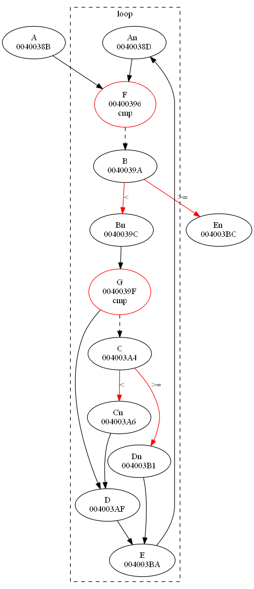

  - part three（switch case结构）

    ```bash
    004003BC: 8B 55 A8           mov         edx,dword ptr [ebp-58h]
      004003BF: 89 55 A0           mov         dword ptr [ebp-60h],edx
      004003C2: 83 7D A0 03        cmp         dword ptr [ebp-60h],3
      004003C6: 77 60              ja          00400428
      004003C8: 8B 45 A0           mov         eax,dword ptr [ebp-60h]
      004003CB: FF 24 85 38 04 40  jmp         dword ptr [eax*4+00400438h]
                00
      004003D2: 6A 00              push        0
      004003D4: 68 64 08 40 00     push        400864h
      004003D9: 68 6C 08 40 00     push        40086Ch
      004003DE: 6A 00              push        0
      004003E0: FF 15 B8 05 40 00  call        dword ptr ds:[004005B8h]
      004003E6: EB 40              jmp         00400428
      004003E8: 6A 00              push        0
      004003EA: 68 88 08 40 00     push        400888h
      004003EF: 68 90 08 40 00     push        400890h
      004003F4: 6A 00              push        0
      004003F6: FF 15 B8 05 40 00  call        dword ptr ds:[004005B8h]
      004003FC: EB 2A              jmp         00400428
      004003FE: 6A 00              push        0
      00400400: 68 AC 08 40 00     push        4008ACh
      00400405: 68 B4 08 40 00     push        4008B4h
      0040040A: 6A 00              push        0
      0040040C: FF 15 B8 05 40 00  call        dword ptr ds:[004005B8h]
      00400412: EB 14              jmp         00400428
      00400414: 6A 00              push        0
      00400416: 68 D0 08 40 00     push        4008D0h
      0040041B: 68 D8 08 40 00     push        4008D8h
      00400420: 6A 00              push        0
      00400422: FF 15 B8 05 40 00  call        dword ptr ds:[004005B8h]
      00400428: 33 C0              xor         eax,eax
      0040042A: 8B 4D FC           mov         ecx,dword ptr [ebp-4]
      0040042D: 33 CD              xor         ecx,ebp
      0040042F: E8 14 00 00 00     call        00400448
      00400434: 8B E5              mov         esp,ebp
      00400436: 5D                 pop         ebp
      00400437: C3                 ret
    ```

​              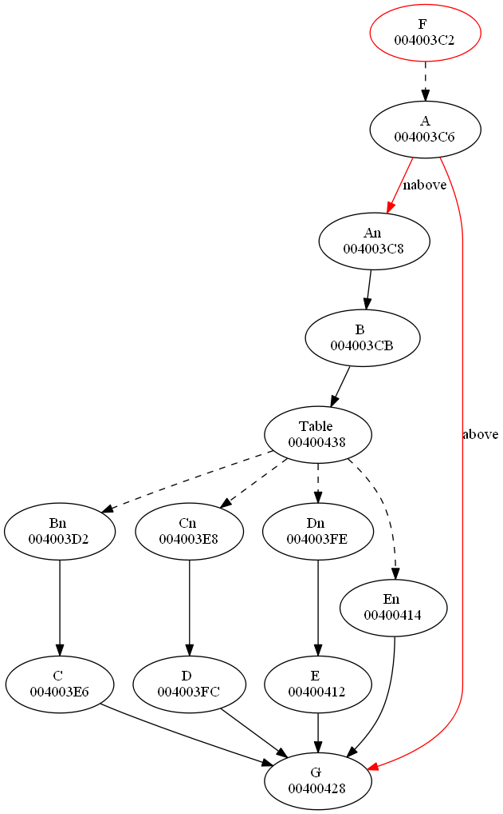

##### (3).主函数内部跳转关系

- 以该基本块起始地址表示(此时划分快包括jmp，jcc，cmp指令)该基本块，跳转关系

```bash
" 0x40032d "->" 0x400338 "
" 0x400338 "->" 0x400382 "
" 0x400382 "->" 0x40032d "
" 0x40038b "->" 0x400396 "
" 0x400396 "->" 0x4003ba "
" 0x40039f "->" 0x4003af "
" 0x4003af "->" 0x4003ba "
" 0x4003ba "->" 0x40038b "
" 0x4003c2 "->" 0x400428 "
" 0x4003cb "->" 0x400428 "
" 0x4003e6 "->" 0x400428 "
" 0x4003fc "->" 0x400428 "
" 0x400412 "->" 0x400428 "
" 0x400428 "->" 0x400428 "
" 0x4002a0 "->" 0x40032d "
" 0x400338 "->" 0x400382 "
" 0x400396 "->" 0x40039f "
" 0x40039f "->" 0x4003af "
" 0x4003c2 "->" 0x4003cb "
```

- Python 代码

```pyhton
###################################################################
############依据jmp，jcc，cmp指令划分主函数的基本块，确定跳转关系###########
###################################################################
maincallfiledisasm=open('/Users/cclin/PycharmProjects/reverseeng/0x4002a0.txt')

callfile=[]
i=0
for line in maincallfiledisasm:
    i+=1
    callfile.append(str(line))
len=i
count =0
chunkcount=0
countbase=0
address_stars=[0]*1000
address_chunkstars=[0]*1000
address_chunkends=[0]*1000
address_jmps=[0]*1000
count_stars=[0]*1000
count_chunkstars=[0]*1000
count_chunkends=[0]*1000
insruct=[0]*1000
for line in range(0,len):
    #获得第一个基本块的起始地址
    if str(callfile[count]).find('push')!=-1 and str(callfile[count]).find('ebp')!=-1:
        address_stars[0]=address_chunkstars[0]=str(callfile[count]).split(':')[0].strip()
        count_stars[0]=count_chunkstars[0]=count
        tempcount=count
    if str(callfile[count]).find('jmp')!=-1 or str(callfile[count]).find('cmp')!=-1:
        chunkcount+=1
        #设置包括jmp或cmp，jcc指令的块起始分割数字
        count_stars[chunkcount]=count
        # 设置包括jmp或cmp，jcc指令的块起始地址
        #当块起始指令为jmp
        if str(callfile[count]).find('jmp')!=-1:
            insruct[chunkcount]='jmp'
            #获得第一个基本块的结束地址
            if chunkcount==1:
                address_chunkends[0]=str(callfile[count-1]).split(':')[0]
                count_chunkends[0]=count-1
            # 设置不包括jmp或cmp，jcc指令的块（基本块）起始分割数字
            count_chunkstars[chunkcount] = count + 1
            startaddress = str(callfile[count]).split('jmp')
            #设置跳转入的地址
            address_jmps[chunkcount] =startaddress[1].split('\n')[0].strip()
            startaddress=startaddress[0].split(':')
            #设置包括jmp或cmp，jcc指令的块起始地址
            address_stars[chunkcount]=startaddress[0]
            address = str(callfile[count + 1]).split(':')
            address_chunkstars[chunkcount] = address[0]

        # 当块起始指令为cmp，jcc
        else:
            insruct[chunkcount] = 'cmp'
            # 设置不包括jmp或cmp，jcc指令的块（基本块）起始分割数字
            count_chunkstars[chunkcount] = count + 2
            startaddress = str(callfile[count]).split('cmp')
            # 设置跳转入的地址
            jmpaddress=str(callfile[count+1]).split(':')
            jmpaddress=jmpaddress[1].split('\t')[2]

            address_jmps[chunkcount]= jmpaddress.strip('\n')
            startaddress = startaddress[0].split(':')
            address_stars[chunkcount] = startaddress[0]
            #设置基本块起始地址
            address = str(callfile[count+2]).split(':')
            address_chunkstars[chunkcount]=address[0]

        countbase=count+1
        #寻找基本块的结束地址
        for countbase in range(count+1,len):
            if str(callfile[countbase]).find('jmp')!=-1:
                endaddress=str(callfile[countbase-1]).split(':')
                #设置基本块的结束地址
                address_chunkends[chunkcount]=endaddress[0]
                #设置基本快的结束分割数字
                count_chunkends[chunkcount]=countbase-1
                break
            if str(callfile[countbase]).find('cmp')!=-1:
                endaddress=str(callfile[countbase-1]).split(':')
                #设置基本块的结束地址
                address_chunkends[chunkcount]=endaddress[0]
                #设置基本快的结束分割数字
                count_chunkends[chunkcount]=countbase-1
                break
            countbase+=1

    count+=1

maincallfiledisasm=open('/Users/cclin/PycharmProjects/reverseeng/0x4002a0.txt')
callfile=[]
for line in maincallfiledisasm:
    callfile.append(str(line))


print("=======================主函数基本块========================")
for k in range(0,chunkcount):

    chunkstart=count_chunkstars[k]
    chunk_body=""
    for l in range(count_chunkstars[k],count_chunkends[k]+1):
        chunk_body=chunk_body+str(callfile[l])
    print("\n===============[",address_chunkstars[k],"]-[",address_chunkends[k],"]=================\n")
    print(chunk_body)
    print("包含jmp或jcc、cmp指令的函数起始地址:",address_stars[k])


#若最后一个基本块不能通过jmp或者cmp、jcc判断划分，综合依据jmp或jcc后跳转的地址判断
body=""
for l in range(count_chunkstars[chunkcount], len):
    if str(callfile[l]).find(address_jmps[chunkcount])!=-1:
        break
    body = body + str(callfile[l])
#设置该模块包括jmp，jcc的块起始地址，起始分割数字，jmp、jcc跳去块地址，基本块起始地址，基本块起始分割数字，基本块结束地址，基本块结束分割数字
count_chunkends[chunkcount]=l-1
address_chunkends[chunkcount]=str(callfile[l-1]).split(':')[0]
address_stars[chunkcount]=str(callfile[count_chunkstars[chunkcount]-1]).split(':')[0]
print("\n===============[",address_chunkstars[chunkcount],"]-[",address_chunkends[chunkcount],"]=================\n")
print(body)
print("包含jmp或jcc、cmp指令的函数起始地址:", address_stars[chunkcount])
count_stars[chunkcount]=l-1

#for，if，else，swich-case划分完基本块后函数剩余部分,此时块没有jmp或jcc、jmp指令，起始地址就是基本块地址
chunkcount+=1
address_chunkstars[chunkcount]=address_jmps[chunkcount-1]
address_chunkends[chunkcount]=str(callfile[len-1]).split(':')[0]
address_stars[chunkcount]=str(callfile[l]).split(':')[0].strip()
address_jmps[chunkcount]="null"
count_chunkstars[chunkcount]=count_chunkends[chunkcount-1]+1
count_stars[chunkcount]=count_chunkstars[chunkcount]
body=""
for l in range(count_chunkstars[chunkcount], len):
    body = body + str(callfile[l])
    if str(callfile[l]).find(address_chunkends[chunkcount])!=-1:
        break
count_chunkends[chunkcount]=l
print("\n===============[",address_chunkstars[chunkcount],"]-[",address_chunkends[chunkcount],"]=================\n")
print(body)

#跳转关系
jmptable=list()
for i in range(1,chunkcount+1):
    jmptable.append(str(address_stars[i]))
jmptable=list(set(jmptable))
jmptable.sort()


print("=======================基本跳转结构========================")
for i in range(1,chunkcount+1):
    if address_jmps[i] in jmptable:
        incress=1
    else:
        incress=0

    jmptable.insert(0,address_jmps[i])
    jmptable.sort()
    index=jmptable.index(address_jmps[i])+incress
    print("\"",address_stars[i],"\"->\"",jmptable[index-1],"\"")
    jmptable.remove(address_jmps[i])

for i in range(0,chunkcount):
    if insruct[i]!='jmp':
        print("\"",address_stars[i],"\"->\"",address_stars[i+1],"\"")
```


#### 5.主函数内部控制流图

##### (1).主函数内部跳转关系图

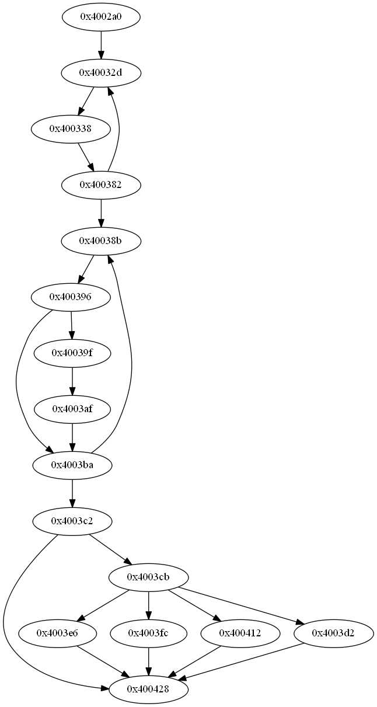


##### (2).生成控制流图

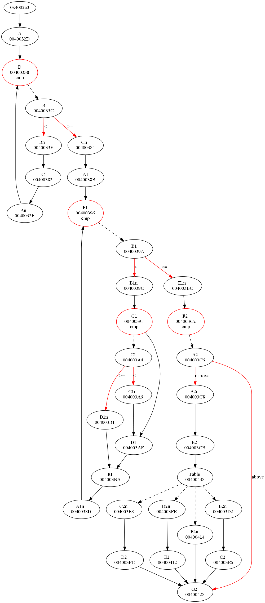

## 四、实验问题

- [ ] 在VS中编译生成的可执行程序直接在开发者工具里利用dumpbin命令进行反汇编，被反汇编得到的汇编指令太多。

- [x] 进行手动编译链接，指定程序入口等，减小生成的可执行文件的体积后再进行反汇编。

```bash
#编译
cl /c /O1 reverseeng.c
#链接
link /nologo /ENTRY:main /NODEFAULTLIB /SUBSYSTEM:WINDOWS /ALIGN:16 /DRIVER user32.lib kernel32.lib libcmt.lib  reverseeng.obj
```

- [ ] 利用cl命令生成.obj，利用link命令生成.exe时总会报错，查询资料耗费较长时间解决。

- [x] 在msdn查询memset，添加msvcrt.lib,libc.lib,依旧报错

- ```
  #编译
  cl /c /O1 reverseeng.c
  #链接
  link /nologo /ENTRY:main /NODEFAULTLIB /SUBSYSTEM:WINDOWS /ALIGN:16 /DRIVER user32.lib kernel32.lib libcmt.lib msvcrt.lib libc.lib reverseeng.obj
  ```

  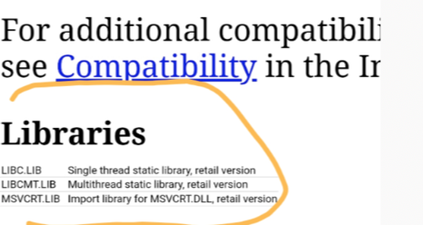

- [x] 依据memset应该是数组操作存在问题，尝试从最初只有数组初始化的命令，到复杂的数组遍历，寻找错误原因，最终将错误锁定在循环中对数组中的元素调用会出现memset。

- [x] 最终通过添加#include<string.h>解决该问题

  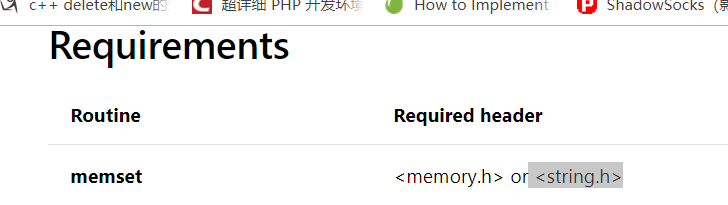

- [ ] 通过执行上述cl，link命令，反汇编代码中存在类似movaps等指令，并且逆向常用的判断指令工具都不能使用，不易进行进一步逆向。

- [x] 修改cl编译命令

  ```bash
  #编译
  cl.exe /c /nologo /TC re.c
  #链接
  link /nologo re.obj /align:16 /entry:main /driver kernel32.lib user32.lib  libcmt.lib
  ```

  

- [ ] 每次生成obj，exe都需要手工输入cl，link，太繁琐。

- [x] 编写makefile

```bash
filename = re

$(filename).exe: $(filename).obj
	link /nologo $(filename).obj /align:16 /entry:main /driver kernel32.lib  user32.lib libcmt.lib 

$(filename).obj : $(filename).c	
	cl.exe /c /nologo /TC $(filename).c
clean :
	del $(filename).obj $(filename).exe

rebuild : clean $(filename).exe
```

- [ ] 通过pyhon代码实现得到函数调用关系划分函数体，主函数通过指令 call 0x400448，调用函数 0x400448，但是0x400448并不是函数的起始地址，能够划分出完整的函数体，0x400448是什么？

- [x] 在运用dumpbin     /disasm 命令反汇编得到的反汇编代码受对齐方式等影响，call 指令后地址0x400448反汇编存在错误，call指令后是函数的起始地址。
- [ ] 关于划分函数基本块，如何划分函数基本块，函数模块能够较好的表示出主函数控制流图

- [x]  在用python代码实现划分函数基本模块时，通过jmp，以及cmp，jcc指令的地址和jmp，以及cmp，jcc指令跳转目标地址划分函数基本块（不包含jmp，以及cmp，jcc指令），和函数模块（包含jmp，以及cmp，jcc指令）。为了较好的表示内部控制流图，以函数模块的起始地址表示该模块，该函数模块包含jmp，以及cmp，jcc指令。

## 五、参考文献

- [ error LNK2019: 无法解析的外部符号 _main，该符号在函数___tmainCRTStartup 中被引用](https://blog.csdn.net/u010803748/article/details/81081763)
- [[Makefile 使用总结](https://www.cnblogs.com/wang_yb/p/3990952.html)](https://www.cnblogs.com/wang_yb/p/3990952.html)

- [原创:反编译原理之*If*-Else条件*跳转*合并-『软件逆..._看雪安全论坛](http://www.baidu.com/link?url=w0p0giT-6kKdxWZd5ODBwPggFqhmyW3qLch3JO8JYcDzFU_KZ9FluBGaBIa9nSrIqz-OQYIYN7DcmidcvF5ao_&wd=&eqid=ae1c5d0f001126a1000000035d3096cf)]

- [深入计算机组成原理（六）指令跳转](https://blog.csdn.net/weixin_41832850/article/details/91397805)
- [使用 Graphviz 生成自动化系统图](https://www.ibm.com/developerworks/cn/aix/library/au-aix-graphviz/index.html)

